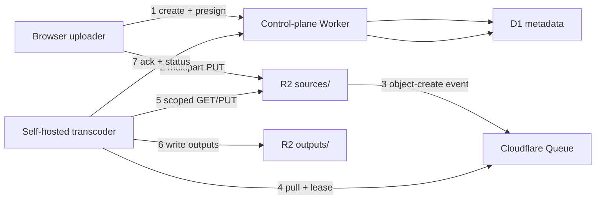
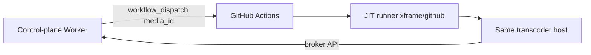
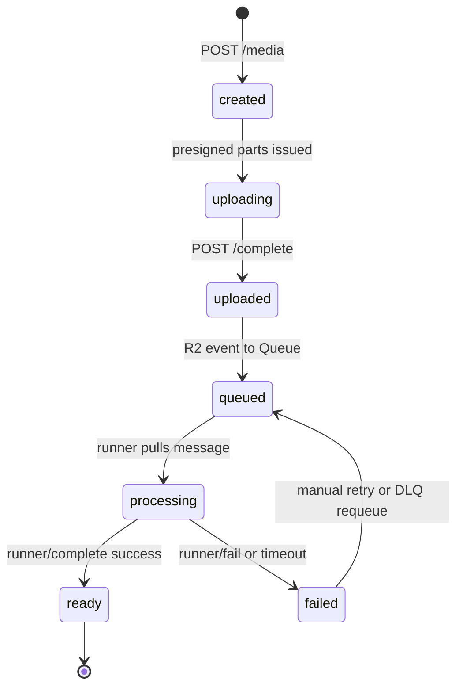

# Cloudflare R2 Media Storage Design

**Status:** Draft  
**Scope:** Source and output media storage for video transcoding in this repository  
**Audience:** Engineers implementing upload, dispatch, and transcode flows

This document replaces the current Git-hosted media path (`xframe/uploads/*.mp4` → raw GitHub URL → `VIDEO_URL`) with private Cloudflare R2 storage and evaluates whether GitHub Actions should remain in the production dispatch path.

## 1. Context

### 1.1 Current state

Today, test media enters the system through git:

1. A user pushes an `.mp4` under [`xframe/uploads/`](../xframe/uploads/README.md).
2. [`.github/workflows/self-hosted-runner-test.yml`](../.github/workflows/self-hosted-runner-test.yml) runs a GitHub-hosted `resolve-video-url` job that builds a public raw URL:
   `https://raw.githubusercontent.com/{owner}/{repo}/{ref}/{path}`.
3. A self-hosted `process-video` job receives only `VIDEO_URL` in its environment.
4. The specialized runner in [`xframe/github/`](../xframe/github/README.md) long-polls the Actions broker, executes Bash steps locally, and skips `uses:` action steps.

Problems with the current approach:

| Issue | Impact |
| --- | --- |
| Public source URLs | Anyone with the link can download the source |
| Git as blob store | Large binaries bloat the repo; no resumable multipart upload |
| Extra resolver job | Adds latency and a GitHub-hosted dependency before transcode starts |
| URL in workflow outputs/logs | Source location is visible in Actions UI |

### 1.2 Target state

- Browsers upload large videos directly to **private R2** via presigned multipart URLs.
- A small **Cloudflare Worker** is the control plane: auth, upload orchestration, job metadata, and runner authorization.
- A **self-hosted transcoder** pulls work from **Cloudflare Queues** (recommended) or optionally from GitHub Actions (transitional).
- Outputs land back in R2 under a predictable key layout; metadata lives in D1 or an existing application database—not in object listings alone.

---

## 2. Goals and non-goals

### 2.1 Goals

- Support **large, resumable** browser uploads (multipart) without routing bytes through the Worker.
- Keep **source and output objects private**; expose only short-lived, scoped authorization to trusted runners.
- Trigger transcode jobs **idempotently** after upload completion.
- Survive **retries, partial failures, and duplicate notifications** without double-encoding or lost outputs.
- Fit the existing **Bash-only self-hosted runner** model during transition.
- Remove git-hosted test media from the production path.

### 2.2 Non-goals

- Running FFmpeg inside Cloudflare Workers (WASM transcode stays on the external runner fleet).
- Replacing the DCP browser-dispatch demo in [`app.js`](../app.js) (out of scope; may share R2 later).
- Building a full media CMS, CDN edge playback, or billing system.
- Replacing GitHub as a **CI and manual-operations** surface (it remains useful there).

### 2.3 Assumptions

- Transcoders are long-lived or periodically started hosts with FFmpeg/WASM tooling already installed.
- Upload clients are browsers or trusted first-party apps (not arbitrary third-party integrators in v1).
- One R2 bucket (or bucket pair: `media` + `logs`) per environment (`dev`, `staging`, `prod`).
- Job metadata (status, tenant, profiles) fits a small relational store (Cloudflare D1 recommended).

### 2.4 Constraints from the existing runner

The specialized GitHub runner has properties that shape any GitHub-based path:

| Constraint | Source | Implication |
| --- | --- | --- |
| Bash-only execution | [`executor.js`](../xframe/github/src/github/executor.js) | Transcode steps must be shell scripts or CLI invocations |
| `uses:` steps skipped | [`executor.js`](../xframe/github/src/github/executor.js) | Cannot rely on marketplace actions on the runner |
| Secret workflow variables omitted from env | [`job.js` `parseAcquiredJobEnvironment()`](../xframe/github/src/github/job.js) | R2 credentials must live on the runner host, not in GitHub secret vars |
| Host env inherited | same function (`env = { ...process.env }`) | `MEDIA_BROKER_TOKEN`, `CF_QUEUES_TOKEN` can be provisioned on the host |
| One-shot JIT lifecycle | [`runner.js`](../xframe/github/src/runner.js) | Each listener invocation handles one job; no built-in queue drain loop |
| Undocumented GitHub broker protocol | [`xframe/github/README.md`](../xframe/github/README.md) | Fragile for production orchestration |

---

## 3. Architecture overview

### 3.1 Recommended production path (Cloudflare-native)



### 3.2 Optional transitional path (GitHub dispatch)



GitHub is **not required** for production. R2 supports `object-create` notifications to Queues, and Queues supports authenticated **HTTP pull consumers** with leases, acknowledgement, and retry—enough to replace Actions as the runtime dispatcher.

---

## 4. Is GitHub still needed?

### 4.1 Verdict

| Role | Needed? | Recommendation |
| --- | --- | --- |
| Runtime job dispatch | **No** | Use R2 event → Queue → pull consumer |
| CI validation of transcode scripts | **Optional** | Keep a thin workflow for regression tests |
| Manual re-run / ops UI | **Optional** | GitHub `workflow_dispatch` or an internal admin page |
| Audit log of transcode runs | **Optional** | Prefer Worker/D1 + structured logs; GitHub adds a second log stream |

**Recommendation:** Remove GitHub from the **production media path**. Retain it for CI, manual recovery, and migration from the current [`self-hosted-runner-test.yml`](../.github/workflows/self-hosted-runner-test.yml).

### 4.2 Benefits of keeping GitHub (ops/CI only)

| Benefit | Why it matters |
| --- | --- |
| Familiar run UI | Operators can re-trigger a transcode from the Actions tab |
| Run history | Built-in retention of who dispatched what and when |
| Repository permissions | Leverage org/repo ACLs for manual operations |
| Concurrency controls | `concurrency:` groups limit parallel runs per branch/profile |
| Code coupling | Tie a transcode script version to a git SHA for reproducibility |
| Existing runner investment | [`xframe/github/`](../xframe/github/) already acquires and completes jobs |

### 4.3 Costs of GitHub in the runtime path

| Cost | Detail |
| --- | --- |
| Extra hop | Upload complete → Worker → GitHub API → broker poll → acquire → run |
| External dependency | Transcode start blocked by GitHub availability and rate limits |
| Secret handling gap | GitHub secret variables are **not** injected into the custom runner env |
| Protocol fragility | Broker/run-service schemas are internal and may change |
| URL/metadata leakage | Workflow inputs/outputs and logs can expose media identifiers |
| Resolver job overhead | Current design needs a GitHub-hosted job before the self-hosted one |
| One-shot runner | Each JIT registration handles one job; scaling requires many invocations |

### 4.4 Cloudflare-native alternative

| Component | Role |
| --- | --- |
| R2 event notifications | Emit `object-create` when multipart upload completes on `sources/.../original` |
| Cloudflare Queue | Durable buffer between upload and transcode capacity |
| HTTP pull consumer | Transcoder pulls batches when ready; controls concurrency locally |
| Cloudflare Workflows (optional) | Durable multi-step orchestration, retries, and status—FFmpeg still runs externally |
| Worker + D1 | Authoritative job state, presigning, runner auth |

Queues pull API supports `batch_size`, `visibility_timeout_ms`, per-message `lease_id`, and explicit ack/retry—matching the semantics the GitHub broker approximates today.

---

## 5. R2 bucket layout

Single bucket per environment: `ffmpeg-dcp-media-{env}`.

```
sources/{tenant_id}/{media_id}/
  original                    # uploaded source (exact extension from client)
  manifest.json               # optional sidecar: size, etag, content-type, checksum

outputs/{tenant_id}/{media_id}/{profile}/
  master.m3u8                 # or single-file output
  segment-00001.ts
  ...
  metadata.json               # duration, codecs, bytes, transcode_version

tmp/{media_id}/
  ...                         # runner scratch; lifecycle-deleted after 24h

logs/{media_id}/
  transcode.log               # optional runner log artifact
```

### 5.1 Key conventions

| Field | Format | Example |
| --- | --- | --- |
| `tenant_id` | UUID or slug | `acme` |
| `media_id` | UUID v4 | `f47ac10b-58cc-4372-a567-0e02b2c3d479` |
| `profile` | Stable slug | `h264-1080p`, `social-instagram-feed` |

### 5.2 Object metadata (R2 HTTP headers)

Set on upload completion:

- `Content-Type`: client-provided, validated allowlist (`video/mp4`, `video/quicktime`, …)
- `x-amz-meta-tenant-id`, `x-amz-meta-media-id`, `x-amz-meta-checksum-sha256`
- `x-amz-meta-upload-session`: upload session id for idempotency

### 5.3 Lifecycle rules

| Prefix | Rule |
| --- | --- |
| `tmp/` | Delete after 1 day |
| `sources/` | Delete after N days if status `failed` or `abandoned`; retain if `ready` per product policy |
| `outputs/` | No auto-delete in v1; optional transition to Infrequent Access after 30 days |

---

## 6. Control-plane Worker API

Base path: `https://media-api.{domain}/v1`

All endpoints require caller authentication unless noted. Responses are JSON.

### 6.1 Upload lifecycle

#### `POST /media`

Create a media record and multipart upload session.

**Request**

```json
{
  "tenant_id": "acme",
  "filename": "clip.mp4",
  "content_type": "video/mp4",
  "size_bytes": 524288000,
  "checksum_sha256": "optional-base64",
  "profiles": ["h264-1080p", "social-instagram-feed"]
}
```

**Response**

```json
{
  "media_id": "f47ac10b-58cc-4372-a567-0e02b2c3d479",
  "upload_id": "upload-session-uuid",
  "source_key": "sources/acme/f47ac10b-58cc-4372-a567-0e02b2c3d479/original",
  "part_size_bytes": 8388608,
  "presigned_parts": [
    { "part_number": 1, "url": "https://...r2.cloudflarestorage.com/...", "expires_at": "2026-08-27T06:00:00Z" }
  ],
  "complete_url": "/v1/media/f47ac10b-.../complete"
}
```

The Worker generates S3-compatible presigned URLs against R2. Bytes never flow through the Worker.

#### `POST /media/{media_id}/parts`

Request additional presigned part URLs (for resumable upload clients).

#### `POST /media/{media_id}/complete`

Finalize multipart upload after client finishes all parts.

**Request**

```json
{
  "upload_id": "upload-session-uuid",
  "parts": [
    { "part_number": 1, "etag": "\"abc123\"" }
  ]
}
```

**Worker actions**

1. Complete multipart upload in R2.
2. Verify size/type against the media record.
3. Set status → `uploaded`.
4. R2 `object-create` notification enqueues transcode work (Worker does **not** need to push to Queue if notification rules cover the key prefix).

#### `GET /media/{media_id}`

Return status, profiles, output keys, error details.

### 6.2 Runner authorization

Runners authenticate with a host-provisioned token (`Authorization: Bearer …`), not R2 root keys.

#### `POST /runner/authorize`

Exchange a queue message or `media_id` for short-lived scoped credentials.

**Request**

```json
{
  "media_id": "f47ac10b-58cc-4372-a567-0e02b2c3d479",
  "profile": "h264-1080p",
  "idempotency_key": "f47ac10b:h264-1080p:v1"
}
```

**Response**

```json
{
  "source_url": "https://...presigned-get...",
  "output_prefix": "outputs/acme/f47ac10b-.../h264-1080p/",
  "put_urls": {},
  "expires_at": "2026-08-27T06:15:00Z"
}
```

Presigned URLs expire in 15 minutes; runner must refresh if transcode exceeds that window.

#### `POST /runner/complete`

**Request**

```json
{
  "media_id": "f47ac10b-58cc-4372-a567-0e02b2c3d479",
  "profile": "h264-1080p",
  "idempotency_key": "f47ac10b:h264-1080p:v1",
  "status": "ready",
  "outputs": [
    { "key": "outputs/acme/f47ac10b-.../h264-1080p/master.m3u8", "bytes": 12345 }
  ],
  "metrics": { "duration_sec": 842.1, "transcode_sec": 93.4 }
}
```

#### `POST /runner/fail`

Same shape with `status: "failed"` and `error_code` / `error_message`.

### 6.3 Optional GitHub dispatch hook

#### `POST /internal/dispatch/github`

Called after `uploaded` if GitHub path is enabled for the tenant.

**Actions**

1. `POST /repos/{owner}/{repo}/actions/workflows/transcode.yml/dispatches` with `{ "ref": "main", "inputs": { "media_id": "..." } }`.
2. Record `github_run_id` on the media record.

Workflow receives only `MEDIA_ID`—never presigned URLs or R2 keys.

---

## 7. Queue message contract (production)

When R2 fires `object-create` on `sources/{tenant}/{media_id}/original`, a notification rule delivers a message to `transcode-jobs-{env}`.

### 7.1 Message schema

```json
{
  "type": "transcode.requested",
  "media_id": "f47ac10b-58cc-4372-a567-0e02b2c3d479",
  "tenant_id": "acme",
  "source_key": "sources/acme/f47ac10b-58cc-4372-a567-0e02b2c3d479/original",
  "profiles": ["h264-1080p", "social-instagram-feed"],
  "idempotency_key": "f47ac10b-58cc-4372-a567-0e02b2c3d479",
  "transcode_version": "2026.08.1",
  "created_at": "2026-08-27T05:00:00Z"
}
```

Filter notification rules with prefix `sources/` and suffix `/original` to avoid spurious events on outputs or temp keys.

### 7.2 Pull consumer loop (transcoder host)

Pseudocode for a long-lived daemon (distinct from the one-shot GitHub JIT listener):

```
loop:
  batch = queues.pull(queue_id, batch_size=N, visibility_timeout_ms=T)
  for msg in batch.messages:
    if job_already_succeeded(msg.body.idempotency_key):
      queues.ack(msg.lease_id)
      continue
    mark_processing(msg.body.media_id)
    creds = broker.authorize(msg.body)
    download(creds.source_url, local_path)
    transcode(local_path, creds.output_prefix)
    broker.complete(msg.body, outputs)
    queues.ack(msg.lease_id)
  on failure:
    broker.fail(...)
    queues.retry(msg.lease_id, delay_seconds=backoff)
```

**Ack only after** outputs are durably written to R2 and `runner/complete` succeeds.

### 7.3 Idempotency

| Key | Scope |
| --- | --- |
| `idempotency_key` on media record | One logical transcode job per upload |
| `{media_id}:{profile}:{transcode_version}` | One encode per profile per version |
| D1 unique index on `(media_id, profile, transcode_version)` | Prevents duplicate work on redelivery |

If a runner crashes after uploading outputs but before ack, redelivery should detect existing outputs (HEAD on `metadata.json`) and ack without re-encoding.

---

## 8. Job state machine



| Status | Meaning |
| --- | --- |
| `created` | Record exists; no bytes in R2 yet |
| `uploading` | Multipart in progress |
| `uploaded` | Source object committed in R2 |
| `queued` | Message visible in Queue (or GitHub workflow requested) |
| `processing` | Runner holds lease / workflow running |
| `ready` | All requested profiles present in `outputs/` |
| `failed` | Terminal error; details in D1 |

**Timeouts**

- `uploading` → `abandoned` after 24h with no `complete` (abort multipart, lifecycle-clean partials).
- `processing` → `failed` if visibility timeout expires without ack (message becomes redeliverable).

---

## 9. GitHub transitional workflow

Replace the current two-job workflow with a single self-hosted job when GitHub dispatch is enabled.

### 9.1 Before (current)

[`self-hosted-runner-test.yml`](../.github/workflows/self-hosted-runner-test.yml):

- Job 1 (`resolve-video-url`, GitHub-hosted): checkout + build public raw URL.
- Job 2 (`process-video`, self-hosted): receives `VIDEO_URL`.

### 9.2 After (transitional)

```yaml
name: Transcode media

on:
  workflow_dispatch:
    inputs:
      media_id:
        description: Opaque media identifier from control plane
        required: true

jobs:
  process-video:
    runs-on: [dcp, wasm, video]
    timeout-minutes: 60
    env:
      MEDIA_ID: ${{ inputs.media_id }}
    steps:
      - name: Transcode from R2
        run: |
          test -n "${MEDIA_ID}"
          ./scripts/transcode-from-r2.sh "${MEDIA_ID}"
```

The job id `process-video` matches [`shouldExecuteProcessVideoJob()`](../xframe/github/src/policy.js), so the existing JIT runner will execute it without policy changes.

Changes:

- Remove `resolve-video-url` entirely.
- Pass only `MEDIA_ID` through Actions (safe to log).
- Script reads `MEDIA_BROKER_URL` and `MEDIA_BROKER_TOKEN` from **host environment** (inherited via `parseAcquiredJobEnvironment()`), not from GitHub secrets.

---

## 10. Security

### 10.1 Threat model (summary)

| Threat | Mitigation |
| --- | --- |
| Unauthorized upload | Authenticated `POST /media`; per-tenant quotas |
| Cross-tenant read | Presigned URLs scoped to one key prefix; broker checks tenant on authorize |
| Leaked presigned URL | Short TTL (15 min); read-only for source, write-only for output prefix |
| Queue message replay | Idempotency keys + D1 status checks before encode |
| Runner impersonation | Bearer token bound to runner identity; rotate on deploy |
| Public GitHub raw URLs | Eliminated—sources never in git |

### 10.2 Credential placement

| Secret | Where it lives | Never in |
| --- | --- | --- |
| R2 access key (signing) | Worker secrets | Browser, GitHub logs, workflow outputs |
| `MEDIA_BROKER_TOKEN` | Runner host env / secret manager | GitHub workflow secret vars (stripped by custom runner) |
| `CF_QUEUES_TOKEN` | Runner host env | Workflow outputs |
| Upload session token | Browser memory / httpOnly cookie | localStorage for long-lived tokens |

### 10.3 CORS (browser upload)

Worker returns presigned URLs; browser uploads **directly to R2**. Configure R2 bucket CORS:

- Allowed origins: app domains only
- Allowed methods: `PUT`, `POST`, `HEAD`
- Allowed headers: `Content-Type`, `x-amz-*`
- Expose: `ETag` (required for multipart complete)

### 10.4 Validation

- Max file size per tenant (e.g. 5 GB v1)
- Content-type allowlist
- Optional magic-byte sniff on `complete` (Worker HEAD + range read)
- Reject `complete` if part etags do not match recorded upload

---

## 11. Observability and operations

### 11.1 Metrics

| Metric | Source |
| --- | --- |
| Upload success rate | Worker |
| Time upload → `queued` | Worker + Queue |
| Queue backlog depth | Cloudflare Queue metrics |
| Transcode duration per profile | `runner/complete` metrics |
| Retry count | Queue ack/retry API |

### 11.2 Logging

- Worker: structured JSON per request (`media_id`, `tenant_id`, `latency_ms`)
- Runner: `logs/{media_id}/transcode.log` in R2 (optional)
- Avoid logging presigned URLs or tokens

### 11.3 Dead-letter queue

After N delivery attempts, move messages to `transcode-jobs-dlq-{env}`. Alert on DLQ depth; operator requeues after fixing root cause.

### 11.4 Manual recovery

| Scenario | Action |
| --- | --- |
| Re-transcode one profile | `POST /internal/requeue` with `{ media_id, profile }` |
| Stuck `processing` | Clear lease via timeout; message redelivers |
| GitHub path enabled | Re-run workflow with same `MEDIA_ID` (idempotent) |

---

## 12. Phased rollout

### Phase 0 — Infrastructure

- [ ] Create R2 bucket, CORS, lifecycle rules
- [ ] Create Queue + R2 notification rule (`sources/` prefix, `/original` suffix)
- [ ] Deploy Worker + D1 schema
- [ ] Provision runner host tokens

### Phase 1 — Upload only

- [ ] Browser uploads to R2 via presigned multipart
- [ ] `GET /media/{id}` reflects status through `uploaded`
- [ ] No transcode yet; validate CORS, checksums, abandonment

### Phase 2 — Cloudflare-native transcode

- [ ] Deploy queue pull daemon on transcoder host
- [ ] Implement `transcode-from-r2.sh` (download → ffmpeg/wasm → upload outputs)
- [ ] End-to-end: upload → queue → transcode → `ready`

### Phase 3 — Decommission git media path

- [ ] Stop triggering workflow on `xframe/uploads/*.mp4` push
- [ ] Migrate test clips to R2 dev bucket
- [ ] Update [`xframe/uploads/README.md`](../xframe/uploads/README.md) to point at R2 upload flow

### Phase 4 — Optional GitHub ops path

- [ ] Add `workflow_dispatch` transcode workflow with `MEDIA_ID` only
- [ ] Use for CI regression and manual operator re-runs—not primary dispatch

---

## 13. Acceptance criteria

- [ ] Browser can upload a **≥500 MB** file resumably via multipart presigned URLs
- [ ] Source object remains **private** (no unauthenticated GET)
- [ ] Upload completion produces **exactly one** queue message per `media_id` (dedupe on idempotency key)
- [ ] Runner transcodes and writes outputs under `outputs/{tenant}/{media_id}/{profile}/`
- [ ] Duplicate queue delivery does **not** produce duplicate encodes
- [ ] Runner crash mid-transcode results in **retry**, not permanent loss
- [ ] Cross-tenant authorize attempts are rejected
- [ ] No R2 root credentials or long-lived presigned URLs in GitHub logs or workflow outputs
- [ ] Git-hosted `xframe/uploads/` path is no longer required for production transcode

---

## 14. D1 schema (sketch)

```sql
CREATE TABLE media (
  media_id TEXT PRIMARY KEY,
  tenant_id TEXT NOT NULL,
  status TEXT NOT NULL,
  source_key TEXT NOT NULL,
  filename TEXT,
  content_type TEXT,
  size_bytes INTEGER,
  checksum_sha256 TEXT,
  profiles JSON NOT NULL,
  idempotency_key TEXT NOT NULL UNIQUE,
  created_at TEXT NOT NULL,
  updated_at TEXT NOT NULL
);

CREATE TABLE media_profile (
  media_id TEXT NOT NULL,
  profile TEXT NOT NULL,
  transcode_version TEXT NOT NULL,
  status TEXT NOT NULL,
  output_prefix TEXT,
  error_code TEXT,
  error_message TEXT,
  started_at TEXT,
  completed_at TEXT,
  PRIMARY KEY (media_id, profile, transcode_version)
);

CREATE INDEX idx_media_tenant_status ON media(tenant_id, status);
```

---

## 15. Related files

| File | Relevance |
| --- | --- |
| [`.github/workflows/self-hosted-runner-test.yml`](../.github/workflows/self-hosted-runner-test.yml) | Current `VIDEO_URL` contract to replace |
| [`xframe/github/`](../xframe/github/) | Optional JIT runner; env and Bash constraints |
| [`xframe/uploads/README.md`](../xframe/uploads/README.md) | Current git-upload trigger documentation |
| [`app.js`](../app.js) | Browser DCP transcode demo (separate dispatch path) |

---

## 16. Open questions

1. **Tenant model:** Single-tenant v1 vs multi-tenant from day one?
2. **Profile catalog:** Hardcoded in Worker vs fetched from repo config?
3. **Output delivery:** Signed download URLs only, or public CDN for finished renditions?
4. **Transcode engine on runner:** Native FFmpeg vs WASM module from this repo?
5. **Workflows:** Use Cloudflare Workflows for multi-profile orchestration, or one queue message per profile?

These do not block Phase 1–2 implementation; defaults above favor single-tenant dev, one message with multiple profiles, and native FFmpeg on the runner host.
